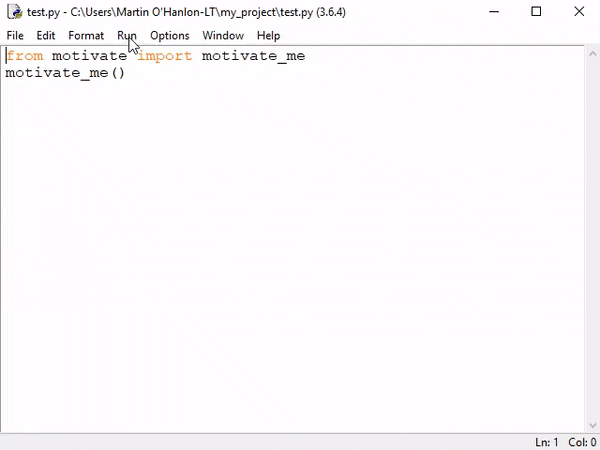

## Introduction

Using Python you very quickly get used to using `import` so you can use other modules within your program, e.g.

```python
from guizero import App
```

or

```python
from numpy import array
```

These **modules** have been created by other programmers and have been shared as a **distribution** which you can install using `pip` e.g.

```bash
pip3 install guizero
```

Bundling up code into distributions which you can share is called **packaging** and makes it much easier for people to get, install and use your programs.

In this project you will create a simple Python module, called `motivate` and package it, learning what you need to know to package your own Pyton code.



--- collapse ---

---
title: What you will learn
---

You will learn:

+ how to structure Python projects
+ how to package Python modules

This project covers elements from the following strands of the [Raspberry Pi Digital Making Curriculum](http://rpf.io/curriculum){:target="_blank"}:

+ [Apply higher-order programming techniques to solve real-world problems.](https://curriculum.raspberrypi.org/programming/maker/){:target="_blank"}
+ [Engage and share with the digital making community.](https://curriculum.raspberrypi.org/community-and-sharing/creator/){:target="_blank"}

--- /collapse ---

--- collapse ---

---
title: What you will need
---

### Hardware

+ A computer capable of running Python 3.

### Software

+ Python 3
+ The following Python modules which can be installed using `pip`:
  + setuptools
  + twine

--- /collapse ---

[[[generic-python-installing-with-pip]]]


If you need to print this project, please use the [printer-friendly version](https://projects.raspberrypi.org/en/projects/project-name/print){:target="_blank"}.

Use the link in the footer to access the GitHub repository for this project, which contains all resources (including an example finished project) in the 'en/resources' folder.
