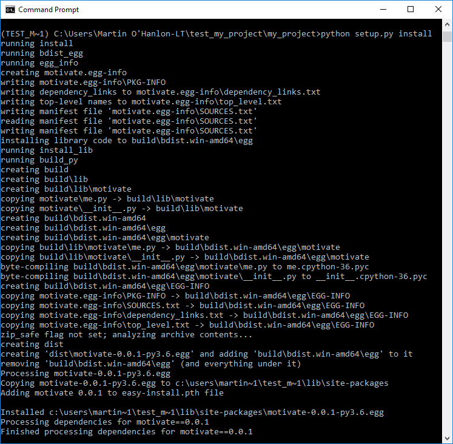
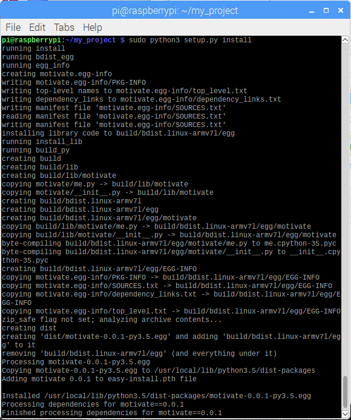
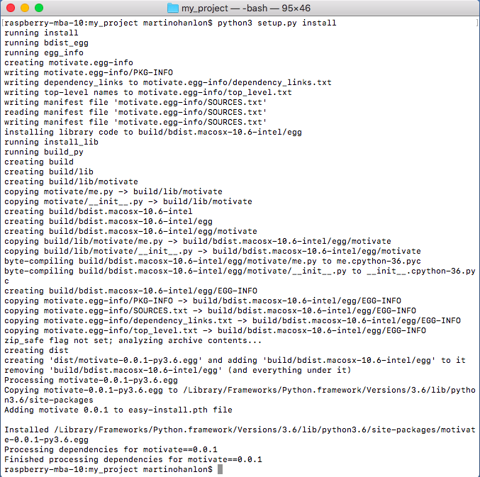

## Installing

To install your module and test the setup, you need to run your `setup.py` program from the **Command Prompt** or **Terminal** as you need to pass the additional `install` parameter.

--- task ---

Run your `setup.py` program.

--- collapse ---

---
title: Windows
---

Open a **Command Prompt**, change directory (`cd`) to your **project** directory and run:

```bash
python setup.py install
```



--- /collapse ---

--- collapse ---

---
title: Raspberry Pi, Linux
---

Open a **Terminal**, change directory (`cd`) to your **project** directory and run:

```bash
sudo python3 setup.py install
```



--- /collapse ---

--- collapse ---

---
title: MacOS
---

Open a **Terminal**, change directory (`cd`) to your **project** directory and run:

```bash
python3 setup.py install
```



--- /collapse ---

--- /task ---

When the setup program has finished, if no errors were reported, you should be able to use use the `motivate` module from any Python 3 program running on your computer.

--- task ---

Test the `motivate` module has been installed by re-creating the simple test program, saving it outside your project directory and running it.

```python
from motivate import motivate_me
motivate_me()
```

**Note:** If you are presented with the error `ImportError: No module named motivate` the install has not completed successfully.

--- /task ---
