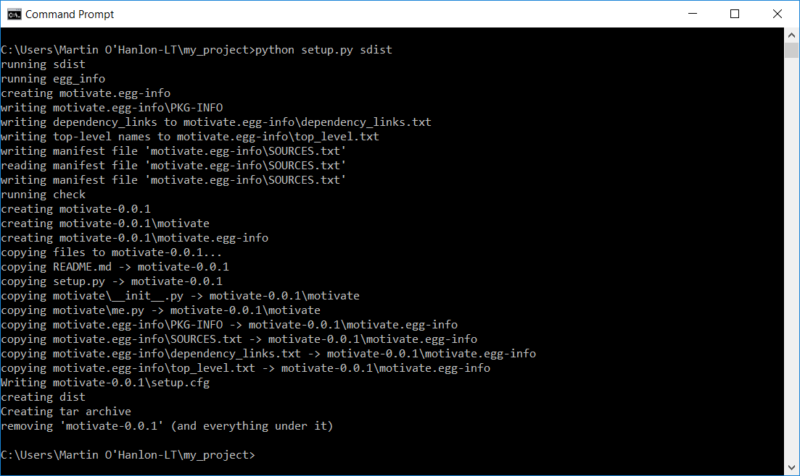
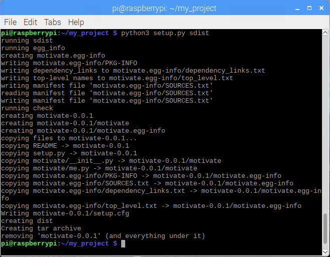
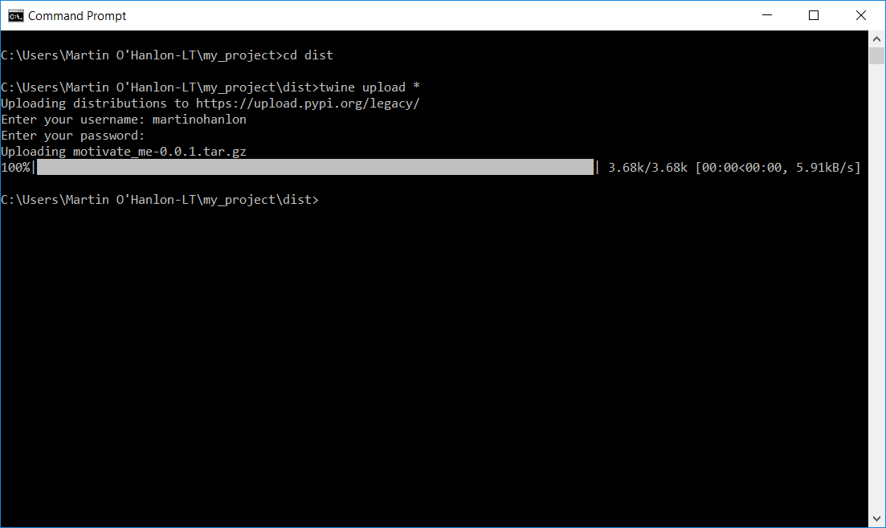

## Uploading to PyPI

[PyPI](https://pypi.org) (the Python Package Index) is the key repository for Python distributions. You can find Python software created and shared by other developers and install it. 

When you install Python modules using `pip` e.g.

```bash 
pip install guizero
```

`pip` downloads the package from [pypi.org](https://pypi.org) and then runs the `setup.py` program for you.

When you have your own Python module that you wish to share and have created a **setup** you can use it to create a **distribution** and upload it to PyPI allowing others to find and install your **package**.

--- task ---

To upload a package to [pypi.org](https://pypi.org) you will need an account. 

Open a browser, go to [pypi.org/account/register](https://pypi.org/account/register/) and create an account.


--- /task ---

--- task ---

Next you will use your setup program to create a **distribution**, this is a compressed file which contains your Python module, its source code and your **setup**.

Open a **Command Prompt** and run your `setup.py` program passing the parameter `sdist`.

--- collapse ---

---
title: Windows
---

```bash
python setup.py sdist
```



--- /collapse --- 

--- collapse ---

---
title: Raspberry Pi, Linux, MacOS
---

Open a **Terminal** and run your `setup.py` program passing the parameter `sdist`.

```bash
python3 setup.py sdist
```



--- /collapse ---

**Note:** the `sdist` parameter tells `setup.py` to create a **source distribution** which can be used to install your module on any computer which can run Python, there are other distributions such as `bdist_wheel` which is a binary distribution and will be quicker to install but may not work on every computer, so it is good idea to always create a source distribution.

--- /task ---

    `setup.py` will have created a directory called `dist` in your **project** directory, this contains the distribution files for your project. 

Once you have created your **distribution** you can upload it to PyPI using `twine`.

--- task ---

Change directory `cd` to the `dist` directory.

```bash
cd dist
```

--- /task ---

--- task ---

Upload all the distribution files `*` using `twine`.

```bash
twine upload *
```

You will be prompted to enter your PyPI username and password, your project will then be uploaded.

--- /task ---



Once you project has been uploaded, it can be downloaded and installed using `pip`.

```bash
pip3 install my_project
```